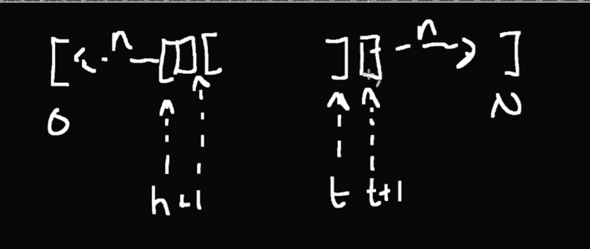

Arrays are the simplest data structure.

## Big O

> Determines which algorithm to use. As your input grows, how fast does computation or memory grow?

1. growth is with respect to the input
2. constants are dropped
3. worse case is usually the way we measure

## Array

> Contiguos memory space.

```
a = int[3]
a[0]
```

This means the computer has to go the address where a lives. Then it offsets it by 0 times the byte type, like in this case `int` is 32 bits.

$$
32 * 0 = 0
$$

```javascript
const a = new ArrayBuffer(a);
const a8 = new Uint8Array(a);
const a16 = new Uint16Array(a);

a8[0] = 45;
// <2d 00 00 00 00 00>
a8[2] = 45;
// <2d 00 2d 00 00 00>
a16[2] = 0x4545;
// <2d 00 2d 00 45 45>
```

Because the offsetting is different, like the a is just a piece of memory while a8 is 8 bit offsetting array and a16 is 16 bit offsetting array that uses the same memory piece as a8 but they have different offsets. So when we do a16[2], we can see its not by 2 slots off, its actually 4 slots off.

> NULL is equivalent to nothing.

Getting an element from an array is constant time: $a + width \* offset$

## The A in DSA

### Linear search

> Simplest algorithm

### Is your dataset ordered?

If data is ordered we could use optimized solution
Like the binary search

## The two crystal ball problem

Simple enough use Square Root Search

## Sorting

### Bubble sort

Insertion sort is harder than bubble sort and its only 3 lines of code.
If neighboring element is lesser than me then we swap places

Gauss's sum formula:
1...100=101
2...99=101
.
.
.
50...51=101

101*50=5051
(N+1)*N/2=K => N(N+1)/2=K

```golang
func bubbleSort(s *[]int) {
	for i := 0; i < len(*s); i++ {
        // i is same as subtracting the already sorted elements size
        // -1 for not go off the bounds of the array
		for j := 0; j < len(*s)-1-i; j++ {
			if (*s)[j] > (*s)[j+1] {
				(*s)[j], (*s)[j+1] = (*s)[j+1], (*s)[j]
			}
		}
	}
}
```

```golang
j < len(*s) - 1 - i
```

is bit difficult to understand, '-1' to not go far off the array and '-i' to not iterate over the same thing again because the last element of each iteration will always be sorted

## const a = [], not an array

## Linked lists

1. Insertions are constant time O(1)
2. Deleteions are constant time too

A -> B -> C; A -> N -> B -> C;

Just set bunch of nexts and previouses.

Weakness of a linked list is that you have to traverse fast enough and it does not use contiguos memory.

## Queue

First in, first out

a -> b -> c -> d

## Stack

Last in, last out

## Arrays vs Linked List

There is no binary search in linked list. So traversing is bit slower. There are trade-offs between the two. If your proccess is removing and inserting constantly its worth thinking about linked lists.

## Can we do better? Combine arrays + linked list.

ArrayList = Array + Linked List

memcopy is moving old array to the new array not cloning.

ArrayList is good with stacks and bad with queues. Queues are bad because inserting in the front and removing from the from its O(n).

ArrayList is just a growing array.

## ArrayBuffer/RingBuffer (VecDeque in Rust)



## Empircal test

```javascript
const a = [];
```

1. get - O(1)
2. push/pop - O(1)
3. un/shift - O(N)

Javascript uses ArrayList.

In conclusion, array is not array list.

## Quick Sort algorithm

Some pivots, I dont understand.
Quick sort uses recursion
Running time of quick sort algorithm is log(n)

It depends, if the array is reverse its gonna be n^2
or if its random n\*log(n)
